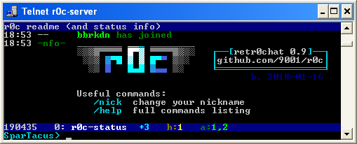

# `r0c` telnet server

* retr0chat, irc-like chat service for superthin clients [(on PyPI)](https://pypi.org/project/r0c/)
* MIT-Licensed, 2018-01-07, ed @ irc.rizon.net
* **[windows telnet 360 noscope](https://ocv.me/r0c.webm)** <- good video



* download the latest release (standalone): **[r0c.py](https://github.com/9001/r0c/releases/latest/download/r0c.py)**

## summary

imagine being stuck on ancient gear, in the middle of nowhere, on a slow connection between machines that are even more archaic than the toaster you're trying to keep from falling apart

retr0chat is the lightweight, no-dependencies, runs-anywhere solution for when life gives you lemons

* tries to be irssi
* zero dependencies on python 2.6, 2.7, 3.x
* supports telnet, netcat, /dev/tcp clients
* fallbacks for inhumane conditions
  * linemode
  * no vt100 / ansi escape codes

## windows clients

* use [putty](https://the.earth.li/~sgtatham/putty/latest/w32/putty.exe) in telnet mode
* or [the powershell client](clients/powershell.ps1)
* or enable `Telnet Client` in control panel `->` programs `->` programs and features `->` turn windows features on or off, then press WIN+R and run `telnet r0c.int`

putty is the best option;
* windows-telnet has a bug (since win7) where unicode letters become unstable the more text you have on the screen (starts flickering and then disappear one by one)
* the powershell client is no longer spammy as of windows 10.0.15063 (win10 1703 / LTSC)

## linux clients

most to least recommended

| client | example |
| :---   | :---    |
| telnet | `telnet r0c.int` |
| socat  | `socat -,raw,echo=0 tcp:r0c.int:531` |
| bash   | [mostly internals](clients/bash.sh) |
| netcat | `nc r0c.int 531` |

you can even `exec 147<>/dev/tcp/r0c.int/531;cat<&147&while IFS= read -rn1 x;do [ -z "$x" ]&&x=$'\n';printf %s "$x">&147;done` (disconnect using `exec 147<&-; killall cat #sorry`)

## firewall rules

telnet uses port 23 by default, so on the server you'll want to port-forward `23` to `2323` (and `531` to `1531` for plaintext):

```bash
iptables -A INPUT -p tcp --dport 23 -m state --state NEW -j ACCEPT
iptables -A INPUT -p tcp --dport 531 -m state --state NEW -j ACCEPT
iptables -A INPUT -p tcp --dport 2323 -m state --state NEW -j ACCEPT
iptables -A INPUT -p tcp --dport 1531 -m state --state NEW -j ACCEPT
iptables -t nat -A PREROUTING -i eth0 -p tcp --dport 23 -j REDIRECT --to-port 2323
iptables -t nat -A PREROUTING -i eth0 -p tcp --dport 531 -j REDIRECT --to-port 1531
```

## documentation

not really but there is a [list of commands](docs/help-commands.md) and a [list of hotkeys](docs/help-hotkeys.md)
