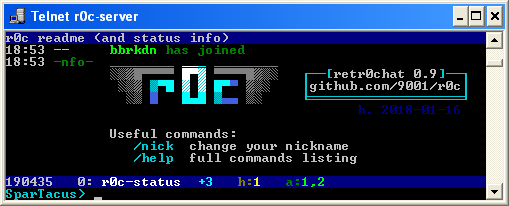

# `r0c` telnet server

* retr0chat, irc-like chat service for superthin clients
* MIT-Licensed, 2018-01-07, ed @ irc.rizon.net
* https://github.com/9001/r0c

## summary

* tries to be irssi
* runs on python 2.6, 2.7, 3.x
* supports telnet and netcat clients
* fallbacks for inhumane conditions
  * linemode
  * no vt100 / ansi escape codes

## supported clients

most to least recommended

| client | example |
| :---   | :---    |
| telnet | `telnet r0c.int` |
| socat  | `socat -,raw,echo=0 tcp:r0c.int:531` |
| bash   | [mostly internals](clients/bash.sh) |
| netcat | `nc r0c.int 531` |
| the oneliner | connecting: `exec 147<>/dev/tcp/r0c.int/531;cat<&147 &while read -rN1 x;do printf '%s' "$x">&147;done` |
|              | disconnecting: `exec 147<&-; killall cat #sorry` |
| powershell   | [if you insist](clients/powershell.ps1)

the powershell client is gonna waste a LOT of data ~~(an entire kilobyte for each new message, totally unbelievable, who could possibly afford that)~~ because powershell's scrolling is glitchy af