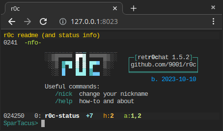

# accessing r0c from a web browser

an actual web-UI will probably happen eventually, but now is not the time

instead let's do something way more fun:

first download [ttyd v1.7.1](https://github.com/tsl0922/ttyd/releases/tag/1.7.1), you probably want [ttyd.x86_64](https://github.com/tsl0922/ttyd/releases/download/1.7.1/ttyd.x86_64)
* latest version is probably fine too but that only works on very recent browsers
* if you're on windows (win10-1809 or later), grab any of the exe's

then drop that binary into this folder, and add r0c.py as well

and finally run this command: [`./webr0c.sh`](webr0c.sh)

now you can r0c from your browser at http://127.0.0.1:8023/

## notes

* probably a bad idea to expose this to the internet

* ctrl-n doesn't work so use the `/v` command instead

* you may want some of [these ttyd args](https://github.com/tsl0922/ttyd/wiki/Client-Options), `-t fontSize=24` / `-t rendererType=dom|canvas|webgl` / `-t disableLeaveAlert=true`

* the ttyd binaries shrink to half their size when compressed with `upx --lzma ttyd.x86_64`
